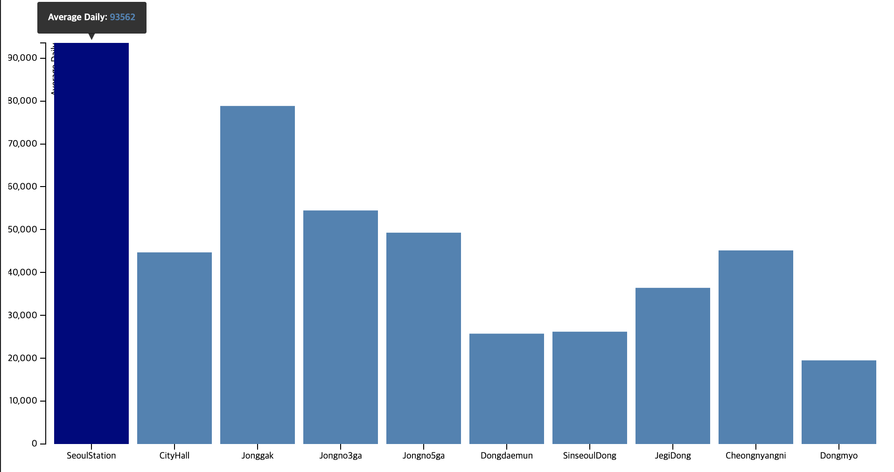

# chart-test

An example project - test d3.js chart

### D3: Data-Driven Documents

D3.js is a JavaScript library for manipulating documents based on data. D3 helps you bring data to life using HTML, SVG, and CSS. D3’s emphasis on web standards gives you the full capabilities of modern browsers without tying yourself to a proprietary framework, combining powerful visualization components and a data-driven approach to DOM manipulation.


### Resources
* [d3.js](https://d3js.org)
* [Gallery](https://github.com/d3/d3/wiki/Gallery)


### Prerequisites

Sample Data

```
Ex. Average number of passengers per day per station from public data portal (.csv file)
```

### Setting Environment

```
Eclipse - create Dynamic Web Project
Check starting Tomcat Server

```

### Development

    - create a html file
    - CDN
            <script src="http://d3js.org/d3.v3.min.js"></script>
            <script src="http://labratrevenge.com/d3-tip/javascripts/d3.tip.v0.6.3.js"></script>
    - refer to the d3 example(Gallary) and draw a chart
    
### Example



